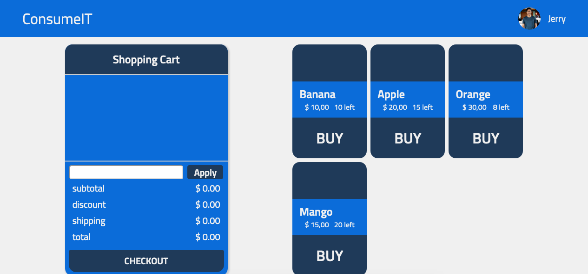
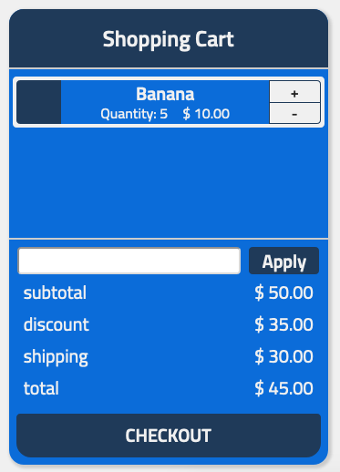
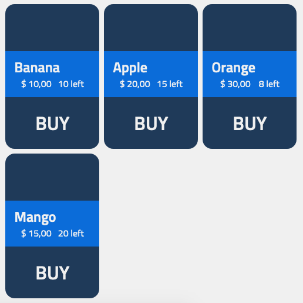

# ConsumeIT:

## Content

1. [Motivation](#Motivation)
2. [Status](#Status) 
3. [Requirements](#Requirements)
4. [Pages](#Pages)
    - [Home](#Visit)

## Status

## Motivation

This repository holds a project called [`ConsumeIT`](https://consume-it.vercel.app/). In this project, I created an online distribution platform.

Users can chose from a given range of products provided by a (rather unreliable) source.

They can purchase them after applying discount codes and checking availability.

You can run it by cloning the repository. Running `cd consume-it`,`yarn install` then executing the command `yarn dev`. `yarn test` to apply tests.

## Requirements

Typescript, React, Next.js, Jest and more.

## Pages
### *Home*
The App consists of an SPA that holds 2 main views, the Shopping Cart View and the Product Display

#### ShoppingCartView
The shopping cart view will always render. It can be affected by purchasing the products clicking `BUY` under the products if they are available.

We can add or subtract items from our cart, dynamically calculating our pricing details.

#### ProductsDisplay
The products display will render if we get a response from the server, allowing us to purchase items.

